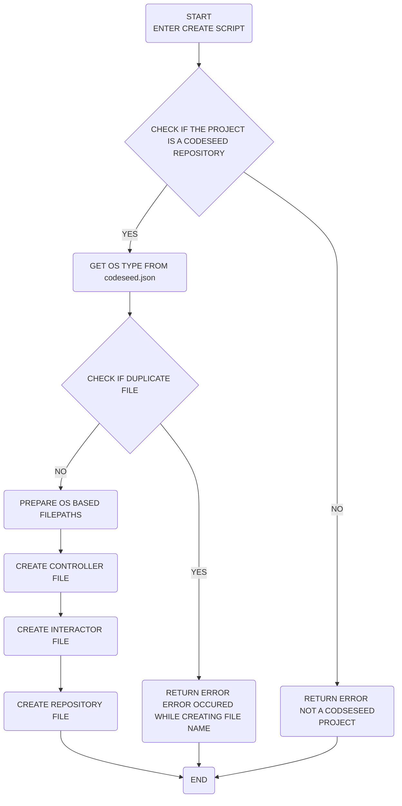

```mermaid
flowchart TD
A(START </br> ENTER CREATE SCRIPT)                                      --> a
a{CHECK IF THE PROJECT IS A CODESEED REPOSITORY}                        --> |YES|G
G(GET OS TYPE FROM codeseed.json)                                       --> D
D{CHECK IF DUPLICATE FILE}                                              --> |YES| E
B(CREATE CONTROLLER FILE)                                               --> b
b(CREATE INTERACTOR FILE)                                               --> c
c(CREATE REPOSITORY FILE)                                               --> Z(END)
D                                                                       --> |NO| H 
H(PREPARE OS BASED FILEPATHS)                                           --> B
E(RETURN ERROR </br>ERROR OCCURED WHILE CREATING FILE NAME)             --> Z
a                                                                       --> |NO|F
F(RETURN ERROR </br> NOT A CODSESEED PROJECT)                           --> Z
```