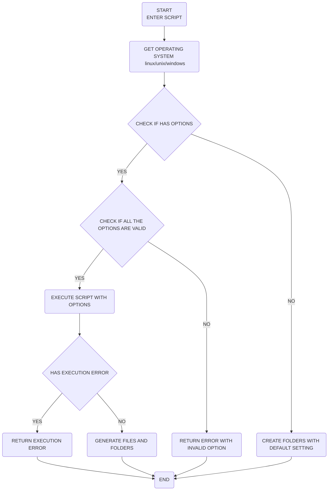

```mermaid
flowchart TD 
A(START </br> ENTER SCRIPT)                             --> a
a(GET OPERATING SYSTEM </br> linux/unix/windows)        --> B
B{CHECK IF HAS OPTIONS}                                 --> |YES|C
C{CHECK IF ALL THE OPTIONS ARE VALID}                   --> |YES|D
D(EXECUTE SCRIPT WITH OPTIONS)                          --> E
E{HAS EXECUTION ERROR}                                  --> |YES|F
F(RETURN EXECUTION ERROR)                               --> Z
G(GENERATE FILES AND FOLDERS)                           --> Z(END)
H(CREATE FOLDERS WITH DEFAULT SETTING)                  --> Z
I(RETURN ERROR WITH INVALID OPTION)                     --> Z
E                                                       --> |NO|G
B                                                       --> |NO|H
C                                                       --> |NO|I
```